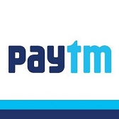

# Paytm Case Study
   
## Overview and Origin

* Paytm ("Pay-T-M", pronounced similar to ATM) is an Indian e-commerce payment system and financial technology company, based out of Noida, India. It is the leading digital payment gateway and digital wallet in India, providing a host of payment services to consumers and businesses. Paytm offers varied payment services such as mobile recharges, utility bill payments, movie tickets, bus, train, and flight tickets, loan payments, insurance, forex, etc. Consumers can link their bank accounts and credit cards to Paytm to enjoy seamless payments at various retail markets and online avenues.

* Paytm was founded in August 2010 with an initial investment of $2 million by its founder **Vijay Shekhar Sharma** in Noida, a region adjacent to India's capital New Delhi. It started off as a prepaid mobile and DTH recharge platform, and later added data card, postpaid mobile and landline bill payments in 2013. Sharma was ranked as India's youngest billionaire in 2017 by the Forbes with a net worth of $2.1 billion.

* Paytm's parent company "one97" was a provider of value added services, custom ringtones, daily horoscope etc. to mobile phone service companies like Airtel and others, between 200-2010. It was around 2010 when Sharma conceived the idea of building a digital payment system Paytm.(aka - pay through mobile). He wanted to eliminate the cost a store owner had to bear to enable their business to accept digital payments e.g. cost of computer or other devices to process payments through cards.

 

* Funding - Paytm has received multi-million dollar funding from top investors such as _Alibaba Group, Softbank, Ant Financial, SAIF Partners, and Mountain Capital_. 
    >**Latest data available on its funding and share holding:**\
     Promoters: One97 communications Ltd&nbsp;&nbsp;&nbsp;&nbsp;&nbsp;38.0%  
     Alibaba Group&nbsp;&nbsp;&nbsp;&nbsp;&nbsp;42.0%  
     Softbank&nbsp;&nbsp;&nbsp;&nbsp;&nbsp;20.0%  
     Total&nbsp;&nbsp;&nbsp;&nbsp;&nbsp;100.0% 

Acquisitions:

Paytm has made various acquisitions over the years such as Near.in, Shifu, EduKart, Shopsity, Insider.in, Little, nearbuy, TicketNew, Cube26, NightStay, and Balance.

## Business Activities:

* The company is striving to eliminate cash transactions and enable digital payments using mobile phones for everyone in India. It provides quick peer to peer (P2P) transfer of money. With the launch of Paytm Payments Bank, it aims to bring banking and financial services to half-a-billion un-served and under-served Indians.

  

* Paytm's customers range from indidual users to small businesses and large market places. Paytm offers easy and quick mobile solutions to payments, money transfer and online shopping and these solutions are specifically created and tailored for the Indian consumers. Paytm was one of the beginners of this digital revoluion, so it has been able to outplay its competitors using its focussed vision and robust technology framework.

* Since the time Alibaba bough a major stake in Paytm, Paytm has been trying to integrate its largest investor Alibaba's technologies with the Indian market.Paytm plans to bring Alipay's credit rating service, called Sesame Credit, to India with a local touch, possibly a different name, and will use a system based on online and offline data to generate individual credit scores for consumers and merchants using Paytm. Paytm apps use QR code technology heavily to authenticate and make payments.

## Landscape:

* The company operates in these domains: Digital wallets/Mobile payments, Online shopping and Digital banking.

* Major trends and innovations have taken place in these domains over the last 5-10 years. Some of these new trends and innovtions are listed below :  
– Steep rise in Mobile Banking.  
– Introduction of various Loyalty Programs.  
– Introduction of Contactless Payment Terminals.  
– Increased use of Biometrics for Security.  
– Increased use of AI to Automate Routine Transactions.  
– Innovations in Cryptocurrency.

* Paytm competes with other digital payment service providers such as MobiKwik, Freecharge, Payumoney, Oxigen, Rechargeitnow, etc. All other digital wallets introduced by various businesses are also actively competing with Paytm.

## Results

* What has been the business impact of this company so far?
Paytm is now available in 11 Indian languages and offers online use-cases like mobile recharges, P2P money transfer, utility bill payments, travel, movies, and events bookings as well as in-store payments at grocery stores, fruits and vegetable shops, restaurants, parking, tolls, pharmacies and educational institutions with the Paytm QR code. It operates in 300 out of 670 districts and has regional offices in 20 main cities of India. It provides payment solutions to more than 7 million merchants and has over 200 million of registered users. Paytm has emerged as a significant contributor in achieving the Digital India dream that is being pursued aggressively by the Indian government. Paytm played a vital role in helping indian people to do digital transacations during Indian Government's sudden ban on certain currency bills in 2016 ([Indian banknote demonetisation](https://en.wikipedia.org/wiki/2016_Indian_banknote_demonetisation)) and since then its has gained a lot of trust and popularity amongst Indian customers.

* Following are the core metrics that companies in this domain use to measure success and Paytm has been  beating expectations by a fair margin on these metrics.
-_Successful to unsuccessful transactions ratio._  
-_Overall conversion rate._  
-_Detailed conversion rate._  
-_Chargebacks and bad debt._  
-_Average revenue per user (ARPU) and average transaction value._  
-_Churn rate._  
* Paytm has been outlaying its competitors since its came into existence. It is way ahead than other players in the Indian market. Some of the statistics suporting this fact are shown below:  
 

## Recommendations

* Paytm should definitely look at international P2P money transfers. India is the second largest populated country and has a large number of people residing outside India who have either immigrated permanently to another country or are temporarily working outside India. They often have to do funds transfer amongst their family members and friends. Right now, other means like Xoom (a Paypal service) are being used by most NRIs (Non-Resident Indians). Paytm already has a strong foothold in india, it can easily capture a lot of existing Xoom customers and may be add more.

* Paytm has a framework available that it uses for Indian customers, it might need to customize and scale up some of that and incorporate international laws and regulations. May be, it can introduce a separate app for International customers.
* Anpther feature that Paytm can probably add to its portfolio is the "Stock Investment and Saving" option similar to what Acorns does. With the large base of active users, Paytm can grow its business and also help increase individual investments into Indian Economy. 

###### _Sources: [Paytm website](https://paytm.com/), [Paytm blog](https://blog.paytm.com/), [Wikipedia->Paytm](https://en.wikipedia.org/wiki/Paytm), [Economic Times India](https://economictimes.indiatimes.com), [Google](https://www.google.com/)_